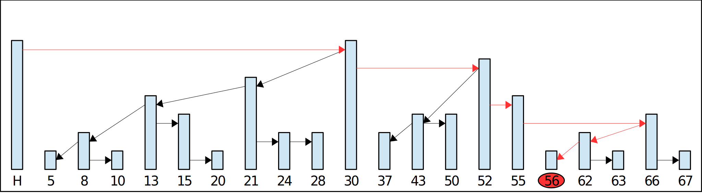
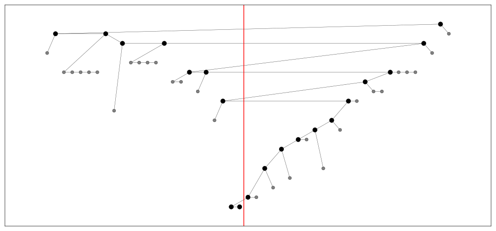
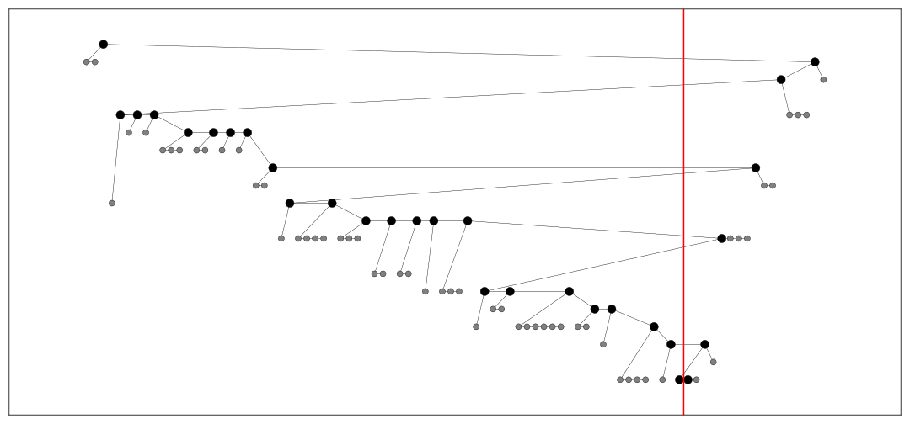
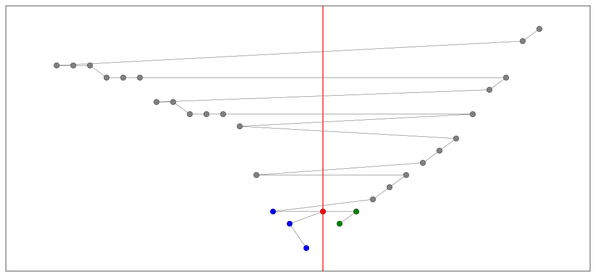
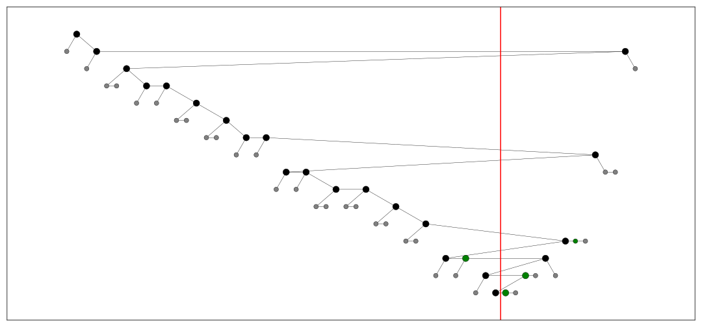
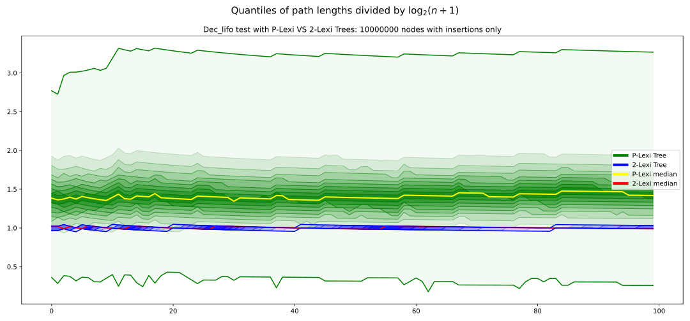

---
html:
  embed_local_images: false
  embed_svg: false
  offline: false
  toc: true

print_background: false

export_on_save:
  html: true
---

# *Lexi Trees*: Probabilistic and Deterministic Self-Balancing Binary Search Trees <!-- omit in toc -->

[Repository on GitHub](https://github.com/mtomassoli/lexi-trees)

## 1. In a nutshell

* I'll introduce a new (to my knowledge) type of trees that I call *Lexi Trees*.
* They're easy to handle as they're little more than *binary trees*.
* In particular, they're easy to *rebalance* and *keep balanced*.
* They're very versatile as we can:
  * Make them *probabilistically* balanced by construction.
  * Rebalance them *deterministically* following two different approaches:
    * **clean after yourself**: We do the operation and then rebalance the tree.
    * **do not litter**: We prepare the tree for the operation, and then do the operation, all without breaking any invariants.
* There's a clear separation between concepts and implementation details:
  * The algorithms are straightforward on a conceptual level.
  * There's no "magic" involved in deriving the actual implementations.

## 2. Exposition

* I use lots of nested lists, as you can already see.
* They help me to:
  * be concise,
  * break down knowledge into small digestible pieces,
  * separate important points from minor points,
  * optimize the order of exposition,
  * refactor what I write,
  * see what I wrote at a glance.
* They should help you to:
  * acquire knowledge one step at a time,
  * pinpoint what you understand and what you find unclear,
  * keep track of where you are (thanks to nesting).
* This document includes lots of pictures.
  * The images of the [Skip Lists](https://en.wikipedia.org/wiki/Skip_list) were drawn by hand, ...
  * ... but all the others were generated from real data.
  * The images only show the relevant details.
  * See [draw_trees.py](https://github.com/mtomassoli/lexi-trees/blob/main/draw_trees.py) and [test.py](https://github.com/mtomassoli/lexi-trees/blob/main/test.py) for the drawing code:
    * The code in those 2 files was not written with readability in mind...
    * ... but I did clean it up a little!
* In general, I try to constantly strike a balance between:
  * verbose and succinct,
  * formal and informal,
  * high level and low level,
  * general and particular.

## 3. List Trees

* A *List Tree* is a binary tree with *extra structure*.
* Nodes can be at any level as long as:
  * the *left* child is at a *lower* level than its parent,
  * the *right* child is at an *equal or lower* level than its parent.
* More formally, for each node $N$:
  * $N\text{.left} = \text{Null} \vee N\text{.left.level} < N\text{.level}$
  * $N\text{.right} = \text{Null} \vee N\text{.right.level} \leq N\text{.level}$
* Right children at the same level as their parent are called *high* children.
* A *leaf* is any node at level 0.
* Paths can have *multiple leaves* because of *high* children.
* A *maximal list* is a sequence $N_1, N_2, \ldots, N_n$ such that:
  * All nodes in it are at the same level.
  * $N_i$.right $= N_{i+1}$ for $i = 1, 2, \ldots, n-1$.
  * (*left&#8209;maximality*) There's no $N$ in the tree such that
    $\qquad N\text{.right} = N_1 \wedge N\text{.level} = N_1\text{.level} $
  * (*right&#8209;maximality*) There's no $N$ in the tree such that
    $\qquad N_n\text{.right} = N \wedge N\text{.level} = N_n\text{.level} $
  * From now on, *list* means *maximal list* unless otherwise specified.

Take a look at the following randomly-generated List Tree:


### 3.1. About the pictures

* For practical reasons, the $X$ axis has been replaced with the *sorted-position* axis.
* More precisely:
  * Let $N_1, N_2, \ldots, N_n$ be the nodes in the tree sorted in *ascending order*, according to their keys.
  * Then, $N_i$ has coordinate $x$ equal to $i$, for $i = 1, 2, \ldots, n$.
* This changes *nothing* at the conceptual level.

## 4. Lexi Trees

* A *Lexi Tree* is a List Tree with a *lexicographic order*.
* Consider the cartesian *KL* plane where:
  * the $X$ axis is for the *keys*,
  * the $Y$ axis is for the *levels*.
* Nodes are points on the KL plane and can be represented as $(k, l)$ pairs.
* Let's impose a lexicographic order on the KL plane:  
$$
  (k_1, l_1) < (k_2, l_2) \Longleftrightarrow
    l_1 < l_2 \vee (l_1 = l_2 \wedge k_1 < k_2)
$$
* In words:
  * The node at a higher level comes first.
  * If two nodes are at the same level, the one with the smaller key comes first.
* Basically, the lexicographic order is:
  * first *top to bottom*,
  * then *left to right*.
* To specify that we're referring to that lexicographic order, we can add the prefix *lexi*, so, for instance, we can say that a node $N_1$ is *lexi*&#8209;smaller than a node $N_2$.
* Analogously, when we want to refer to just the keys, we can say that $N_1$ is *key*&#8209;smaller than $N_2$.
* When we work on the KL plane, *the arrows become redundant!*

### 4.1. Rules for the arrows

* Imagine that from each node starts a vertical line which goes straight to the bottom:
  * *No arrow can cross that line.*
* This is true for all binary *search* trees in general.
* More precisely:
  * The root owns the whole *key&#8209;space*.
  * Each node $N$, of key $k$, splits its key&#8209;space $S$ into 2 subspaces:
    * *left&#8209;space*: the part of $S$ with keys $\leq k$.
    * *right&#8209;space*: the part of $S$ with keys $> k$.
* The left (right) arrow of each node $N$ is either
  * *absent* if $N$ has no nodes in its left (right) space, or
  * *pointing to* the *lexi*&#8209;smallest node in the left(right)&#8209;space.
* Intuitively, this means that if a node $N$ has a row of nodes, all at the same level, right below $N$ in the same subspace, then $N$ always points to the leftmost one.

Here are a few examples:


Here's a bigger one, but without labels for lack of space:


### 4.2. Operations

* Lexi Trees support two primitive operations:
  * *lifting*: to lift a node, increment its level by 1 and fix the arrows.
  * *lowering*: to lower a node, decrement its level by 1 and fix the arrows.
* In general, we can $k$&#8209;lift or $k$&#8209;lower a node, i.e. lift or lower it by $k$ levels.
* An insertion at level $L$ can be seen, conceptually, as an $L+1$&#8209;lifting from level -1.
* A deletion from level $L$ can be seen, conceptually, as an $L+1$&#8209;lowering to level -1.
* Note:
  * The left-to-right order of the keys is fixed and beyond our control.
  * We can play with the levels however we want, though.
  * Rebalancing a tree is nothing but readjusting the levels without touching the keys.

## 5. P&#8209;Lexi Trees

* *P&#8209;Lexi Tree* is short for *Probabilistic* Lexi Tree.
* All root$\to$leaf paths in P&#8209;Lexi Trees have *expected* length $\mathcal O(\log n)$.
* The expectation is over all the possible P&#8209;Lexi Trees that can be randomly generated given the same sequence of operations.
* Nodes:
  * are *inserted* at random heights,
  * can't be *moved* around once in the tree,
  * can be *deleted*.
* P&#8209;Lexi Trees work as expected (pun intended) *if and only if* [Skip Lists](https://en.wikipedia.org/wiki/Skip_list) work, because...

### 5.1. P&#8209;Lexi Trees are *isomorphic* to Skip Lists

#### 5.1.1. Proof (sketch)

* Let's consider the following Skip List:
  
* Let's find, say, key 56:
  
* Note that we only use the highest arrow ***to*** a node during searches, so we can remove the others:
  
* Now each node has just one parent, but can still have several children.
* We can reduce the number of children by doing the following:
  * **for each** node $N$:
    * **let** $A^h$ be the highest arrow *starting from* $N$.
    * **for each** arrow $A$ that *starts from* $N$, with $A\neq A^h$:
      * **let** $A_2$ be the arrow *right above* $A$.
      * **let** $N_2$ be the node *pointed to* by $A_2$.
      * make $A$ *start* from $N_2$ rather than from $N$.
* For instance:
  * Header $H$ has 5 forward arrows.
  * The highest arrow points to node 30
  * The 2nd-highest arrow points to node 21:
    * we change its starting point so that it starts from node 30.
  * The 3rd-highest arrow points to node 13:
    * we change its starting point so that it starts from node 21.
  * and so on...
* Here's the result:
  
* First *cosmetic* change: let's make the arrows start from the *top* of the nodes:
  
* Second and last *cosmetic* change: let's shorten the nodes:
  
* The transformations are *invertible* so we can also transform a Lexi Tree into a Skip List.

### 5.2. Why do Skip Lists work?

Here's my intuition:

* Let *SL* be the perfectly balanced Skip List in the following figure:
  
* **The height distribution**
  * Note that *SL*, ignoring the *header* (the gray node), has:
    * 8 nodes of height 1
    * 4 nodes of height 2
    * 2 nodes of height 3
    * 1 node of height 4
  * For $k = 1, 2, 3, 4$, the nodes of height > $k$ are 1 fewer than the nodes of height $k$.
  * As the number of nodes in *SL* goes to infinity, though, that difference of 1 node becomes insignificant, so...
  * ... the distribution of the heights approaches the [geometric distribution](https://en.wikipedia.org/wiki/Geometric_distribution).
  * We can generate the heights from the geometric distribution, with parameter $p = 0.5$, simply by repeatedly tossing a fair coin:
    ```python
    height = 1
    while coin toss == heads:
        height += 1
    ```
  * Note that, by convention, *height* $=$ *level* $+ 1$.
  * Since we toss a fair coin to decide whether we stop at the current height or we keep going, the following probabilities are equal:
    * the probability of a node being at level $L$,
    * the probability of a node being *above* level $L$.
  * This means that we *expect* the following values to be equal:
    * the number of nodes at level $L$,
    * the number of nodes *above* level $L$.
  * That should make the connection between *SL* and the geometric distribution clear.
* Now think of the nodes as $(key, level)$ pairs.
* Shuffle the levels (i.e. swap them between nodes), but keep the keys fixed.
* If the shuffle is uniform enough, we expect the root$\to$leaf paths (or their equivalent in a Skip List) to be of length $\mathcal O(\log n)$ *on average*.
* By starting with an empty Skip List and inserting nodes with heights chosen from the same geometric distribution as *SL*, we're, basically, directly generating the shuffled version of *SL*.

### 5.3. Operations

#### 5.3.1. Nodes

* Since nodes are never moved around once inserted, we can optimize a few things:
  * *leaves* only need the *right pointer*
  * The *level* in lower nodes can be represented as few bits.
    * Since there are, *on average*, exponentially many more lower nodes than higher nodes, this saves a considerable amount of space.

#### 5.3.2. Search Paths

* *Key searches* don't need to know the level of the nodes, so:
  * key searches are the same as in binary trees.
* Here are a few examples of search paths in a P&#8209;Lexi Tree with 1M nodes:
  
  
  
  
  
* The red line is the *key line*, i.e. the position of the key we searched for.
* Notice that we found the key in two cases.
* When the key is not found, the key line indicates its *insertion position*.
* During key searches:
  * We're *almost always* moving to nodes closer to the key line:
    * all other nodes are ignored.
  * I said *"almost always"* because there's a *single exception*:
    * When we find the *key node*, we usually either:
      * stop the search, or
      * go *left* one single step and then:
        * go all the way to the *right* to get to the *rightmost* leaf *key*&#8209;before the key node.
    * *Note*:
      * if we step *left* from the *key node*, then:
        * all the nodes we visit from that point onward will have keys smaller than the searched-for key.
* Let's add *some* of the ignored nodes:
  
  
  
  
  

#### 5.3.3. Insertions

* To insert a node of key $K$ we first search for $K$.
* If $K$ is already present, we stop:
  * for a *set*, we could just *return*;
  * for a *map*, we could just *update* the *value* of the key node and *return*.
* We must also choose a random *insertion level* $L$ the same way as for Skip Lists.
* While we're searching for $K$, we also remember some important points along the search path.
* These important points:
  * are at level $\leq L$,
  * are 4 per level at most, 2 per side,
  * come in $(first, last)$ pairs, where we may have $first = last$.
* Let's look at some examples before saying anything more:
  * **Before** insertion at level 0:
    
  * **After** insertion at level 0:
    
  * The blue node is the pair $(first, last)$, with $first = last$, on the left side.
  * *We need to remember that pair*.
  * Note that all the nodes above level 0 are grayed out because we don't need to remember them.
  * Now look for a pattern as we change the insertion level $L$.
  * $L = 3$:
    
  * $L = 7$:
    
  * $L = 12$:
    
  * $L = 19$:
    
* Basically, the red node is like a pair of scissors that cut along the red key line, starting from the bottom and going upwards up to level $L$.
* That's why the important nodes we need to remember are at or below the insertion level $L$.
* Here's the $L = 19$ case again, *before* the insertion:
  
* I'll call *"crossing the red key line"* simply *"the crossing"*.
* From the picture above we can see that:
  * $G_2$ is the *last* node before the crossing
  * $B_1$ is the *first* node right after the crossing
  * $B_2$ is the *last* node before the crossing
  * $G_3$ is the *first* node right after the crossing
  * and so on...
  * By convention, we say that $G_1$ is also in the "first node" category.
  * The $(first, last)$ pairs are then:
    * $(G_1, G_2)$
    * $(B_1, B_2)$
    * $(G_3, G_4)$
    * $(B_3, B_4)$
    * $(G_5, G_5)$
    * $(B_5, B_5)$
    * and so on...
  * We don't need to remember the black nodes.
* Now let's look again at the situation *after* the insertion:
  
  * The inserted red node points to $B_1$ and $G_1$.
  * B1 starts the *left chain* and $G_1$ the *right chain*.
  * The *last* node of each pair connects to the *first* node of the pair right after it, on the same side, i.e. blue with blue and green with green.
  * The black nodes are left untouched and that's why we don't need to remember them.

#### 5.3.4. Deletions

* For the deletion, just consider the two pictures above in the opposite order!
* Basically:
  * an *insertion* is a multi-level *splitting* operation, while
  * a *deletion* is a multi-level *merging* operation.
* To delete a node:
  * Find the node $N$ to delete.
  * Let's say $N$ is the red point in the last picture above.
  * The *left chain* starts with $N\text{.left}$.
  * The *right chain* starts with $N\text{.right}$.
  * We follow the *left chain* by always going *right*.
  * We follow the *right chain* by always going *left*.
  * Note that both chains are *lexicographically ordered*.
  * This suggests a *merge sort* step of the two chains!
    * We keep two pointers, one per chain, and...
    * ... take one step along the chain with the lexi&#8209;smaller node, ...
    * ... and repeat until we're done merging the chains.
    * Of course, when we *cross*, we *link*.
    * For example, if nodes $N_1 <_\text{lexi} N_2$ are adjacent in the merged sequence and they're on different sides, then we make $N_1$ point to $N_2$ using $N_1$'s left or right pointer as appropriate.
* For once, the deletion is easier than the insertion!

### 5.4. Parallelization

* P&#8209;Lexi Trees are easy to parallelize because *all operations go down*, from root to leaf.
* The higher-in-the-tree operation just need to wait for the lower-in-the-tree operation to finish.
* *No* operation needs to give up to avoid a *deadlock*.

## 6. $k$-Lexi Trees

* A $k$-Lexi Tree is a Lexi Tree where:
  * each list has length $k$ at most
  * all root$\to$leaf paths are *complete*
* A path $P$ is complete $\Longleftrightarrow$
  * for each level $l$ from 0 to the level of the root,
    * there's a node in $P$ at level $l$.
* Intuitively, a path is complete $\Longleftrightarrow$ it has no *holes*.
* A $k$-Lexi Tree is $k$-balanced, i.e. each root$\to$leaf path has length at most $k\log_2(n+1)$.
* Every node at level 0 is considered a *leaf*.
* Leaves can only have *high* right children.
* Of course, we just need a single bit to indicate a *high* right node.
* *Practical consideration*: In the source code, a $k$-Lexi Tree is called a D$k$LTree, where "D" stands for *deterministic*.

## 7. 2&#8209;Lexi Trees

* Recall:
  * for each list $L$:
    * $\text{length}(L) \leq 2$
  * *no holes* along any root$\to$leaf path
* **Example**
  * Here's a 2&#8209;Lexi Tree with 100 nodes:
    
  * This was created by inserting 100 random uniformly distributed nodes one after the other.

### 7.1. Insertion

* We *insert* the new node $N$ into the correct position at level 0, as a *leaf*.
* $N$ is now in a list $L$ of length at most 3.
* If $L$ has 3 nodes, we *lift* the middle one, go a level higher along the search path, and keep lifting middle nodes until needed, going up.
* **Example**:
  * Here are the pictures *before* and *after* the insertion *without* rebalancing:
    
    
  * Here's the picture *after* the rebalancing:
    
  * Here's the full animation:
    

### 7.2. Deletion

* We *delete* a leaf $N$ by, well, *removing* it.
* If that removal leaves a *hole*:
  * we go up one level to the (ex-)parent $P$, along the search path,
  * we *lower* $P$ to close the hole below,
  * and repeat the process as many times as needed...
* To delete an internal node $N$, we replace it with the *rightmost leaf* on its *left*, i.e. the leaf immediately *key*&#8209;before it. This is a classic trick.
* If the leaf leaves a hole at level 0, we proceed as before.
* **Example**
  * Here are the pictures *before* and *after* the deletion of the node *without* rebalancing:
    
    
  * Here's the picture *after* the rebalancing:
    
  * Here's the full animation:
    
  * Let's focus on the lower levels and add another level of gray nodes:
    (*before*)
    
    (*after*, *without rebalancing*)
    
    (*after*, *with rebalancing*)
    
    (*animation*)
    
  * The two animations look weird:
    * Why are the gray nodes *lifted* rather than *lowered* as we'd expect?
    * This happens because there's no way to represent an *internal* hole.
    * To do that, we'd need a way to indicate that a node is 2 levels lower than its parent.
    * This is what should happen when we lower B2 to close the hole:
    ```text
           B1          ==>      B1
          /  \         ==>     /  \                B = black
         /    \        ==>    /    \               g = gray
       g1      B2      ==>  g1      \    
              /        ==>           \ 
            g2   hole  ==>            g2 --> B2
    ```
    * That is, the hole *"bubbles up"* and it's midway between B1 and g2.
    * What happens, instead, is that we just connect B1 to g2 this way:
    ```text
           B1          ==>      B1
          /  \         ==>     /  \
         /    \        ==>    /    \
       g1      B2      ==>  g1      g2 --> B2
              /        ==>
            g2   hole  ==>
    ```
    * Note that g2 --> B2 makes sense because we shouldn't compensate for the fact that g2 is higher than it should.
    * This means that the algorithm has to remember where the hole is, since it's not represented in the tree.
    * This is not a problem, of course, but just an implementation detail.
    * Ultimately, the two cases merge when the hole is closed *for real*.
    * For instance, let's say B1 is the *high* right child of some node B0:
      * This is the *conceptual* picture:
      ```text
      B0 --> B1               ==>  B0 
            /  \              ==>    \ 
           /    \             ==>     \
         g1      \            ==>      g1 --> B1
                  \           ==>               \         
                   g2 --> B2  ==>                g2 --> B2
      ```
      * This is the picture of the *actual* tree:
      ```text
      B0 --> B1              ==>  B0  
            /  \             ==>    \
           /    \            ==>     \
         g1      g2 --> B2   ==>      g1 --> B1
                             ==>               \         
                             ==>                g2 --> B2
      ```
      * Note that we *lower* B1 by just:
        * make B0 point to g1
        * make g1 *high*-point to B1
        * (Of course, if g1 has a *right* child C, then C will become the *left* child of B1.)
    * This always happens at the end of the rebalancing.
    * My suggestion is that one thinks about and works with the *conceptual* picture:
      * In the actual implementation it's enough to remember which side the hole is on.
      * Since each hole is closed right after it's created, this never becomes an issue in practice.

### 7.3. Additional Remarks

* Note that to go back up towards the root (to rebalance the tree) we can just *remember* the path we took during the descent.
* Of course, the *remembering* is
  * *explicit* in an *iterative* implementation, and
  * *implicit* in a *recursive* one.
* For the actual (iterative) implementation, see section [Implementations](#implementations) below.

### 7.4. Parallelization

* 2&#8209;Lexi Trees are *not* so easy to parallelize because...
* ...operations are *bidirectional*:
  * ***down&#8209;phase***: search + insertion / removal
  * ***up&#8209;phase***: *rebalance* by repeatedly *lifting* or *lowering* nodes, going up.
* When an operation in its down&#8209;phase meets an operation in its up&#8209;phase, we've got trouble.
* As I said before, I like to think that 2&#8209;Lexi Trees follow the *Clean after yourself* approach.

## 8. 3&#8209;Lexi Trees

* Recall:
  * for each list $L$:
    * $\text{length}(L) \leq 3$
  * *no holes* along any root$\to$leaf path
* **Example**
  * Here's a 3&#8209;Lexi Tree with 100 nodes:
    
  * This was created by inserting 100 random uniformly distributed nodes one after the other.
  * Note that full lists are rare at the higher levels.

### 8.1. Insertion

* We want to insert a new node $N$.
* We search for the right position at level 0 to insert $N$.
* While we do the searching along a root$\to$leaf path, we *lift* the middle node of every list of length 3 we come across.
* The lifting is always possible since, by the time we reach a node, its parent can't be in a list of length 3.
* We insert $N$.
* **Example**:
  * Because of the repeated *lifting*, triples are surprisingly hard to find:
    * In a tree of 1M nodes, I could find *no* instance of 5 consecutive triples at the end of a search path.
  * Here are the pictures *before* and *after* the insertion:
    
    
  * Here's the full animation:
    
  * Let's focus on the lower levels and add another level of gray nodes:
    (*before*)
    
    (*after*)
    
    (*animation*)
    
  * We *lift* the green nodes as we go *down*.
  * Note how:
    * each *lift* makes room for the *lift* *below* it, and
    * there's technically *no **re**balancing* whatsoever going on.

### 8.2. Deletion

* We want to remove a node with key $K$.
* We do a root$\to$leaf search for $K$, collecting 3 pieces of information along the way:
  * $KN$: the node with key $K$, if any.
  * $LE$: the *leaf* immediately *key*&#8209;before $KN$:
    * We just go *left* one step when we find $KN$ and then...
    * ... we go all the way to the right.
    * $LE$ is the last node in the search path.
  * $LO$: the last node we found that can be *lowered*.
* **Example**
  
* A node is *lowerable* if lowering it won't leave a hole.
* In particular, a node is *lowerable* if
  * it's in a list of at least 2 nodes, *or*
  * it has at least 3 children.  
  For instance:
      ```text
                N       ==>       S2
          _____/ \      ==>      /  \
         /        \     ==>     /    \
       S1 -> S2    N2   ==>   S1      N -> N2
      
      Lowering N doesn't leave a hole because S2 takes its place.
      ```
* Below $LO$ there are *no* lowerable nodes.
* If $LO$ is a leaf, then $LO$ is $LE$.  
  *Proof:*
  * $LO$ is in the same list as $LE$.
  * $LE$ is lowerable because it's in a list of at least 2 nodes.
  * $LE$ is the last node.
  * $LE$ is the last lowerable node.
  * $LE$ is $LO$.
* We lower the sub-path $LO\to LE$.
* In other words, we lower all the nodes starting from $LO$.
* That's possible since there are *no* lowerable nodes *below* $LO$, so there's space:
  * That's the whole point of finding $LO$ in the first place.
* By lowering the sub-path, we make sure $LE$ is in a list with at least 2 nodes.
* We can now remove $LE$ without leaving a hole.
* If $LE$ is $KN$, we just remove $LE$.
* If $LE$ is not $KN$, just like with 2&#8209;Lexi Trees, we replace $KN$ with $LE$.
* **Example**
  * Here are the pictures *before* and *after* the deletion:
  
  
  * Here's the animation:
  
  * Let's focus on the lower levels and add another level of gray nodes:
  (*before*)
  
  (*after*)
  
  (*animation*)
  
  * Note that:
    * The green nodes are *lowered* while going *down*:
      * This is always possible by definition of $LO$.
    * Like with insertions, there's technically *no **re**balancing* whatsoever.

### 8.3. Additional Remarks

* **Lowerable Nodes**:
  * During a search, if a node $N$ is in a list alone, we normally need to do an extra lookup to tell whether it's *lowerable* or not.
  * This can be avoided by keeping additional information on $N$:
    * we could use 1 bit to tell whether $N$ has at least 3 children, or
    * 2 bits, one per side, to tell whether each side has at least 2 children.
  * The version with 2 bits is more efficient to keep up to date during the operations.
  Basically:
    * the 2 bits are the *high* bits of the pointed nodes,
    * assuming those bits are set only when the right nodes really exist.
* **Lifting VS lowering**:
  * We could use something analogous to $LO$ for *insertions* as well.
  * We don't do it because, in general:
    * *lifting* *shortens* the paths, which is *good*:
      * we can *lift as much as we want*
    * *lowering* *lengthens* the paths, which is *bad*:
      * we should *lower as little as possible*:
        * LO$\to$LE is the shortest subpath we need to lower
* We could also lift during normal searches (i.e. outside insertions or deletions).
* By performing many liftings we can, in principle, keep the paths as short as the ones in 2&#8209;Lexi Trees.
* For the actual implementation, see section [Implementations](#implementations) below.

### 8.4. Parallelization

#### 8.4.1. High Level

* 3&#8209;Lexi Trees should be easier than 2&#8209;Lexi Trees to parallelize because...
* ...operations have only *down*&#8209;phases:
  * ***down&#8209;phase***: search + lifting (for insertions),
  * ***down&#8209;phase***: lowering (for deletions).
* I like to say that 3&#8209;Lexi Trees follow the *Don't litter* approach.
* The difference is that:
  * 2&#8209;Lexi Trees break the invariants during insertions/deletions and *then* fix the tree.
  * 3&#8209;Lexi Trees prepare the tree *beforehand* for the insertions/deletions so that they don't break the invariants *at all*.
* This is the case because:
  * 3&#8209;Lexi Trees can break lists of length 3 and make room.
  * 2&#8209;Lexi Trees can't break or shorten lists of length 2 to make room.
  * 2&#8209;Lexi Trees need to wait for the appearance of lists of length 3 before they can break them, but those lists are a *violation* of the invariants.

#### 8.4.2. Low Level

* It's a pity I don't have time to implement this :(
* What follows is *conjectural*.

##### 8.4.2.1. Versioning

* We can add a *version* field to the nodes and implement something similar to a [SeqLock](https://en.wikipedia.org/wiki/Seqlock).
* This way we can do searches without locking any nodes.
* When we go through nodes $A, B, C,\ldots$ along the search path, we do:
  * $V_A = A\text{.version}$
  * $B = A\text{.right}$ (assuming we need to go right)
  * $V_B = B\text{.version}$
  * **if** $V_A \neq A\text{.version}$:
    * we need to go back and restart from $``V_A = A\text{.version}"$.
  * **else**:
    * $C = B\text{.left}$ (assuming we need to go left)
    * $V_C = C\text{.version}$
    * **if** $V_B \neq B\text{.version}$:
      * we need to go back and restart from $``V_B = B\text{.version}"$.
    * etc...
* We need to memorize the path so that we can go back when something changes under our feet.
* We want to avoid a single problem: *skipping nodes*.
* We can inadvertently skip a node in two cases:
  * the *node* is *lifted above* us,
  * *we* are *lowered below* it.
* During the updates, the *version* of each node $N$ must be updated (i.e. incremented) every time:
  * $N$ is *lowered*, *or*
  * nodes that come *lexi*&#8209;after $N$ (along the search path) are *lifted*.
* The fact the lists have length 3 at most simplifies things because we just need to look at adjacent nodes:
  * This is not true in general, but...
  * ... it should be the case with my current implementation:
    * See [lift.py](https://github.com/mtomassoli/lexi-trees/blob/main/lift.py) and [lower3.py](https://github.com/mtomassoli/lexi-trees/blob/main/lower3.py), in particular.
* Note that we don't care if nodes we left behind are lifted. All we care about is that no node moving in the after$\to$before direction can pass through us without us realizing it.
* We're dealing with *pointers*, so we must use some kind of blazingly fast *constant time* Garbage Collector:
  * We keep lists of nodes to delete (one list per execution unit $\implies$ no synchronization required)
  * When we are sure that no operations currently accessing the tree can have a reference to certain nodes, we deallocate those nodes.
  * We should *only* use *timestamps* and completely ignore the values of the pointers.
  * The timestamps might be owned by the lists (of nodes to delete) rather than by the nodes themselves:
    * this would reduce the number of timestamps and comparisons.

##### 8.4.2.2. Locking

* We could *lock* nodes by setting 2 bits in the *version* field.
* I'd use two types of locks:
  * *reserve*: Nobody can modify this node, but we're not modifying it either at the moment, so searches can go through without problems.
  * *mutation*: We're actually modifying the node.
* Nodes should be locked in *lexicographic order* to avoid *deadlocks*:
  * The lexicographic order is handy because we don't need to do any extra sorting.

##### 8.4.2.3. Deletions

* Deletions are way more complicated than insertions.
* What follows is a little involved because of the need to lock nodes in *lexicographic order*.
* I would proceed as follows:
  * During the search we remember all the potential $LO$s (we already   remember the path to be able to go back, anyway).
  * When we reach $KN$, the node to delete, we put a *reserve* lock on it.
  * From this point onward, we also keep a *reserve* lock on the latest $LO$.
  * We do this by moving the lock from $LO$ to $LO$ by first locking the new $LO$ and *then* unlocking the previous one.
  * **If** we found no $LO$ after $KN$:
    * We unlock $KN$ (because of the lexicographic order requirement),
    * we go back to the latest $LO$ and keep going back to the previous saved $LO$s until we find a valid one (remember the *versioning*?).
    * **If** we don't find a valid $LO$:
      * we restart from the root.
    * We go down again, tracking the latest $LO$ with a *reserve* lock.
    * When we reach $KN$, we put a *reserve* lock on it.
    * We keep tracking the latest $LO$, even jumping over $KN$.
  * When we reach the leaf:
    * we turn the *reserve* locks into *mutation* locks,
    * we carry out the operation.
* Why do all that?
  * It's a *heuristic*:
    * The *happy path* should be good enough.
    * There's no risk of *starvation* (i.e. of trying forever without ever completing the operation).
  * Other heuristics with different guarantees are certainly possible.

## 9. Implementations <a id="implementations"></a>

* I implemented one *single-threaded* version of:
  * P&#8209;Lexi Trees
  * 2&#8209;Lexi Trees
  * 3&#8209;Lexi Trees
* I'm sure many other (substantially different) implementations are possible.
* I won't go over the specific cases and similar details because I find them terribly boring and uninteresting.
* Since that's the way I roll, I decided to write *readable source code* instead:
  * I chose the *Python* language because it reads almost as *pseudo-code*.
    * You can install all the external dependencies with
      `pip install -r requirements.txt`
    * I tested the code with *CPython* (Python 3.9) and *Pypy* (Python 3.8).
    * It's a pity *static typing* is a little clunky (compared to *Typescript*).
  * I prioritized *readability* and *simplicity* both at the *language* and the *algorithmic* level.
  * All the cases are documented in the code:
    * I like to include remarks, small proofs, and ASCII pictures in my code.

### 9.1. P&#8209;Lexi Trees

* See file [PLTree.py](https://github.com/mtomassoli/lexi-trees/blob/main/PLTree.py).
* I don't think there's anything important left to explain:
  * the gap between the *conceptual* and the *concrete* implementation is negligible.

### 9.2. 2- and 3&#8209;Lexi Trees

* For 2-Lexi Trees, see files:
  * [D2LTree.py](https://github.com/mtomassoli/lexi-trees/blob/main/D2LTree.py): main file
  * [DLTree.py](https://github.com/mtomassoli/lexi-trees/blob/main/DLTree.py): common file
  * [lift.py](https://github.com/mtomassoli/lexi-trees/blob/main/lift.py): *lift* operation
  * [lower2.py](https://github.com/mtomassoli/lexi-trees/blob/main/lower2.py): *lower* operation
* For 3-Lexi Trees, see files:
  * [D3LTree.py](https://github.com/mtomassoli/lexi-trees/blob/main/D3LTree.py): main file
  * [DLTree.py](https://github.com/mtomassoli/lexi-trees/blob/main/DLTree.py): common file
  * [lift.py](https://github.com/mtomassoli/lexi-trees/blob/main/lift.py): *lift* operation
  * [lower3.py](https://github.com/mtomassoli/lexi-trees/blob/main/lower3.py): *lower* operation
* The code should be clear enough, but I want to point out a couple of *gotchas*:
  * Some operations alter the search paths so:
    * if one saves the search path:
      * one needs to keep it up to date by fixing it when necessary,
      * or just be aware of the changes.
  * For instance, in a *deletion*, replacing the key node $KN$ with the leaf $LE$ *does* modify the search path, so one should update the saved list as well.
  * Similarly, the operations may change the order of the nodes one's standing on:
    * in my implementation, the *lift* and *lower* functions return some useful information to help with that.
* The most interesting files are certainly:
  * [lift.py](https://github.com/mtomassoli/lexi-trees/blob/main/lift.py)
  * [lower2.py](https://github.com/mtomassoli/lexi-trees/blob/main/lower2.py)
  * [lower3.py](https://github.com/mtomassoli/lexi-trees/blob/main/lower3.py)
* They contain all the cases for the *lift* and *lower* operations:
  * Every case is illustrated with an ASCII picture.
  * Those illustrations are very important so I'll briefly describe how to interpret them.

#### 9.2.1. Case I of *lift* in [lift.py](https://github.com/mtomassoli/lexi-trees/blob/main/lift.py)

```text
# Case I: prev.right = cur
# P            ==>  P --> r
#  \           ==>       / \
#   c  r  r2   ==>      c   r2
#     /        ==>       \ 
```

* The "==>" wall is a before$\Rightarrow$after wall, that is, it separates the situation *before* from the situation *after* the operation.
* Let's call the left and the right sides the *before* and *after* sides, respectively.
* This is not so important now but:
  * $P$ = *parent*
  * $c$ = *cur*,
  * $r$ = *right*
  * $r2$ = *right2*
* The horizontal arrows/segments between $c$, $r$, and $r2$ on the *before* side in the picture above are omitted for clarity.
* Let's call the arrows (`/` and `\`) at the bottom of the picture *downward arrows*.
* Because $r$ is *lifted*, the node pointed to by $r\text{.left}$ will be pointed to by $c\text{.right}$.
* This is the only change relative to the eventual children of $c$, $r$, and $r2$.
* Because of this, $r\text{.left}$ and $c\text{.right}$ are the only downward arrows depicted.
* Going from the *before* to the *after* side:
  * the downward arrows move,
  * but *never* change in number.

#### 9.2.2. Case II of *lift* in [lift.py](https://github.com/mtomassoli/lexi-trees/blob/main/lift.py)

```text
# Case II: prev.left = cur
# P2 ------------.   P2  ==>  P2 ---.   .-------- P2
#                 \ /    ==>         \ /
# P2 ------------> P     ==>  P2 ---> r ---> P
#        _________/      ==>         /      / 
#       /                ==>        /      /
#      c   r   r2        ==>       c     r2
#     /   /              ==>      / \
# NOTE: Prev2 can be in any of the 3 positions shown above.
```

* $P2$ is *Prev2*, of course.
* As the NOTE says, $P2$ can be in 3 different positions:
  * above $P$, on its right
  * above $P$, on its left
  * at the same level of $P$, on its left:
    * $P$ is the *high* right child of $P2$.
* The only difference is that we must modify the correct pointer of $P2$.
* Note that $P2\text{.high\_right}$ (a *bit*, in practice) is left untouched:
  ```python
  if prev2.right is prev:
      prev2.right = right         # keeps same high_right
  else:
      prev2.left = right
  ```

#### 9.2.3. Case Right of *lower* in [lower3.py](https://github.com/mtomassoli/lexi-trees/blob/main/lower3.py)

```text
# Case Right3
# P --.    .------------ P  ==>  P ----------.    .----- P
#      \  /                 ==>               \  /
# P --> c1 - - - - - > r    ==>  P ----------> o2 - -> r
#      /  \    _ _ _ _/     ==>       ________/  \    /
#     /    \  /             ==>      /            \  /
#   c2      o1  o2  o3      ==>     c2  c1  o1     o3
#     \    /   /            ==>        /   /  \
#
# Case Right2
# P ---.    .--------- P  ==>  P -------.    .----- P
#       \  /              ==>            \  /
# P ---> c1 - - - -> r    ==>  P -------> o1 - -> r
#       /  \    _ _ /     ==>        ____/  \    /
#      /    \  /          ==>       /        \  /
#    c2      o1  o2       ==>      c2  c1     o2
#      \    /             ==>         /  \  
```

* Since these two cases are very similar, I consider them a single one.
* The only novelty is that $r$:
  * As an example, Case Right3 can be expanded as:
    ```text
    # Case Right3-no-r
    # P --.    .------------ P  ==>  P ----------.    .----- P
    #      \  /                 ==>               \  /
    # P --> c1                  ==>  P ----------> o2       
    #      /  \                 ==>       ________/  \     
    #     /    \                ==>      /            \   
    #   c2      o1  o2  o3      ==>     c2  c1  o1     o3
    #     \    /   /            ==>        /   /  \
    #
    # Case Right3-r
    # P --.    .------------ P  ==>  P ----------.    .----- P
    #      \  /                 ==>               \  /
    # P --> c1 ----------> r    ==>  P ----------> o2 ---> r
    #      /  \    _______/     ==>       ________/  \    /
    #     /    \  /             ==>      /            \  /
    #   c2      o1  o2  o3      ==>     c2  c1  o1     o3
    #     \    /   /            ==>        /   /  \
    ```
    * Note that *now* the arrows from and to *r* are *continuous*.

#### 9.2.4. Remarks

* The *lower* function *lifts* nodes as well, when needed.
* The cases can be simplified by decoupling the lowerings and the liftings.
* I designed *lower* that way because:
  * I didn't want operations to break invariants.
  * I didn't want to set arrows one way just to change them an instant later.
* I don't know if it was worth it, though:
  * As always, one should try several variations and see what are the *pros* and *cons* of each.

## 10. Tests & Statistics

### 10.1. Tests

* I use what I call a *seasonal* test:
  * Its seasonal nature is controlled by two parameters:
    * $N$, the *number of operations*
    * $C$, the *number of cycles*
  * The test performs a total of $N$ operations.
  * The operations are *conceptually* chunked into $C$ contiguous sequences of $N/C$ operations.
    * (In the actual implementation, the $C$ cycles are mapped directly to the $N$ operations.)
  * In each chunk:
    * Each operation can either be an *insertion* or a *deletion*.
    * The time goes from $t=0$ to $t=2\pi$.
    * At time $t$, the probability $p$ of the current operation being an *insertion* is $(\sin t + 1) / 2$.  
    In fact:
    $$
    \begin{align*}
    t \in [0, 2\pi] &\xrightarrow{\sin} [-1, 1] \\
                 &\xrightarrow{(+1)} [0, 2] \\
                 &\xrightarrow{(/2)} [0, 1] \ni p
    \end{align*}
    $$
  * The tree tends to grow when $p>0.5$ and shrink when $p<0.5$:
  
* Of course, the test is full of *asserts* and it also checks the *invariants* of the tree at regular intervals of time.
* The test also takes a *key picker* which generates the keys to insert and delete.

### 10.2. Key Pickers

* A *key picker* is implemented as a class *KeyPicker*.
* Here's the *interface*:
  ```python
  class KeyPicker(Protocol[K_Cov]):
      def get_ins_key(self) -> K_Cov:
          """NOTE: The returned key is remembered and can be returned by
          get_del_key."""
          ...

      def get_del_key(self) -> K_Cov | None:
          """NOTE: The returned key is forgotten."""
  ```
* I implemented the simple key pickers illustrated in the following image:
  
* The image was created by requesting first $N$ insertions and then $N$ deletions.
* Remember, though, that the real test chooses the type of each operation at random, according to the cycle.
* *Uniform*:
  * The *keys to insert* are (almost) *uniformly distributed* over a given interval.
    * I said *"almost"* because I use *round* instead of *floor* to map the floats to ints.
  * The *keys to delete* are returned in random order.
  * Sometimes, the *key picker* returns (on purpose!) *keys to delete* that were never inserted.
* The *FIFO* versions return the *keys to delete* in the same order as the *keys to insert*.
* The *LIFO* versions invert the order, unsurprisingly.
* *Center FIFO* and *Center LIFO* are the only ones (*"almost"* above aside) that generate keys that are *NOT uniformly distributed*.
* Here's the code for *Center FIFO*:
  ```python
  def _get_center_key(count: int):
      sign = 1 - 2*(count & 1)
      return sign * 1/count

  class CenterFifoKeyPicker(KeyPicker[float]):
      _start_count: int = 0
      _end_count: int = 0

      def get_ins_key(self):
          self._end_count += 1
          return _get_center_key(self._end_count)

      def get_del_key(self):
          if self._start_count != self._end_count:
              self._start_count += 1
              return _get_center_key(self._start_count)
          return None
  ```

### 10.3. Statistics

#### 10.3.1. Method

* The test collects, at regular intervals of time, the lengths of the root$\to$leaf paths:
  * Note that the lengths of the paths from the root to *internal* nodes are ignored.
  * The path lengths are divided by $\log_2(N+1)$, i.e. the *optimal* length of the path lengths.
  * This means that we end up with *ratios*, where 1.0 means optimal.
  * $k$-Lexi Trees guarantee that the ratios are never above $k$.
  * Just knowing the *worst case* is not enough.
  * I wanted to know more about the *ratio distribution*.
  * I first tried *sampling*:
    * I found the [min_key, max_key] interval for the keys.
    * I generated $K$ uniformly distributed keys in that interval.
    * I searched for each one of those $K$ keys, measuring the length of each search path.
    * The time complexity is $\mathcal O(K\log N)$ (in *expectation*, for P-Lexi Trees).
    * **CONS**:
      * It only works when the keys are actually *uniformly distributed*.
      * In particular, it won't work with the *Center FIFO* and *Center LIFO* key pickers.
  * I then decided to compute the exact *min*, *max*, *mean*, and *std*:
    * The time complexity is $\mathcal O(N)$.
    * **CONS**:
      * The ratio distribution is **NOT** *Gaussian* and not even symmetric.
      * The *standard deviation* is not enough.
  * The final implementation computes the full set of path lengths:
    * The *empirical distribution* is summarized by selecting 19 evenly spaced *quantiles*, including the *min* and the *max*.
    * The time complexity is $\mathcal O(N)$.

#### 10.3.2. Results

* First of all:
  * We expect the P&#8209;Lexi Trees graphs to be independent of the key distribution.
  * **Trivia**:
    * The graphs were good,
    * but then I added the two Center key pickers and
    * they gave me very odd results.
    * I first suspected that `random()` was the culprit and tried a better PRNG.
    * Then I remembered that I was *sampling* the path lengths...
    * ... assuming that the keys were *uniformly distributed*, and...
    * ... the Center key pickers definitely break that assumption.
* I decided to conduct two types of tests:
  * *insertions only*, 10M operations
  * *both* operations, 20M operations, 2 cycles.
* *Uniform* Picker, *insertions only* (10M ops):
  * Let's first see the separate graphs:
    
    
    
  * Here's a direct comparison between P&#8209;Lexi and 2&#8209;Lexi Trees:
    
  * As we can see, 2&#8209;Lexi Trees are vastly superior to P&#8209;Lexi Trees, at least in this case.
  * Here's the comparison between 2&#8209;Lexi and 3&#8209;Lexi Trees:
    
  * 2&#8209;Lexi Trees appears to be only slightly better than 3&#8209;Lexi Trees.
  * This makes the 3&#8209;Lexi Trees surprisingly good.
  * In all cases, the quantiles are all clustered around the medians, which means that...
  * ... there are few very short and very long paths.
* *Uniform* Picker, *both* operations (20M ops, 2 cycles):
  * Again, let's start with the separate graphs:
    
    
    
  * And here are the comparisons:
    
    
  * The situation didn't change much, so the deletions don't seem to cause any problems.
  * We can see a spike in the middle (50 on the $X$ axis), but that's probably due to random noise:
    * ... the trees are very small at that time, because of the 2 cycles.
    * It's like when you toss a coin: a few tosses won't give you a great estimation of the true mean and...
    * ... if you repeat the experiment you'll get big variations.
  * Note that we shouldn't expect the P&#8209;Lexi Trees to do better or worse in different situations.
  * If that happens, we have a bug somewhere! Remember the *Trivia* above.
* Here are all the other cases for the P&#8209;Lexi Trees:
  <details>
  <summary>Show Images</summary>
  
  
  
  
  
  
  
  
  
  
  
  
  </details>
* Here are the ones for the 2&#8209;Lexi Trees:
  <details>
  <summary>Show Images</summary>
  
  
  
  
  
  
  
  
  
  
  
  
  </details>
* And here are the ones for the 3&#8209;Lexi Trees:
  <details>
  <summary>Show Images</summary>
  
  
  
  
  
  
  
  
  
  
  
  
  </details>
* Here are all the comparisons between P&#8209;Lexi and 2&#8209;Lexi Trees:
  <details>
  <summary>Show Images</summary>
  
  
  
  
  
  
  
  
  
  
  
  
  </details>
* And here are all the comparisons between 3&#8209;Lexi and 2&#8209;Lexi Trees:
  <details>
  <summary>Show Images</summary>
  
  
  
  
  
  
  
  
  
  
  
  
  </details>
* As we noted before, P&#8209;Lexi Trees shouldn't and, in fact, aren't influenced by the key pickers.
* The 2- and 3&#8209;Lexi Trees exhibit *strong asymmetry*:
  * That's to be expected since only right children can be *high*.
  * The exceptionally good cases are:
    ```text
                            LHS     RHS   (of the tree)
    Dec FIFO, inserts only:  I--------
    Dec LIFO, inserts only:  I--------
    Dec LIFO, both ops:     DI--------
       where:  I = inserts; D = deletes
    ```
  * As indicated in the scheme above, these are all cases where we operate on the LHS of the tree.
  * This suggests that we might want to invert the order of the keys if we suspect that the order will be mostly *ascending*.
* The 2- and 3&#8209;Lexi Trees are somewhat influenced by the key pickers, but:
  * Most of the paths are *very* close to the *optimum*.
  * The other paths are still way below 2 times the optimum.
  * This is very good, considering that 3&#8209;Lexi Trees give only a $3\log_2 N$ guarantee.
* To do a complete analysis of 3&#8209;Lexi Trees, we should distinguish 2 kinds of paths:
  * *hot* paths: the *high* traffic paths
  * *cold* paths: the *low* traffic paths
* This is especially true if searches are also able to *lift* nodes when they find triples. That would guarantee that:
  * *hot* paths are of length $2\log_2 N$ at most
  * *cold* paths are of length $3\log_2 N$ at most
* Since *cold* paths are, by definition, *low* traffic, this would make 2- and 3&#8209;Lexi Trees virtually indistinguishable regarding the path lengths.
* 3&#8209;Lexi Trees are heavier than 2&#8209;Lexi Trees algorithmically, though.
* 2&#8209;Lexi Trees should always be preferred for the single-thread case.
* 3&#8209;Lexi Trees should be more performant than 2&#8209;Lexi Trees in the multi-threading settings, but this is still a *conjecture*.

## Thanks   <!-- omit in toc -->

Thank you for reading this! I hope you had a good time :)
